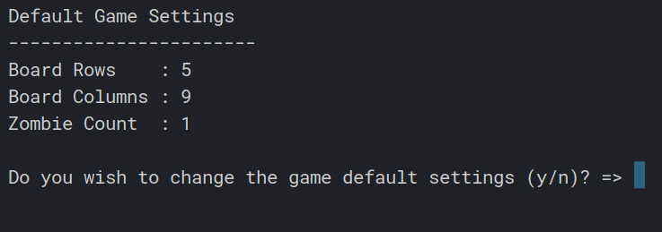
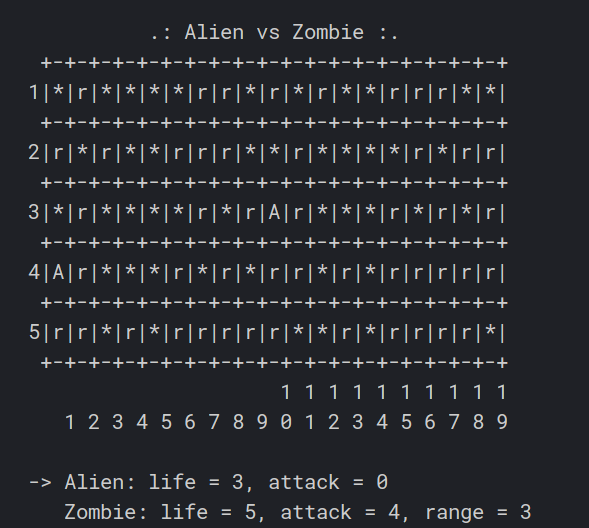

# Alien vs. Zombie

Command-line Program of a simple game inspired by 'Alien Path'.

Game Settings

<p align="center">

</p>

Game Dashboard

<p align="center">

</p>

## Compilation Instructions

How to run the code?

```
g++ pf/*.cpp main.cpp -o main.exe && ./main.exe
```

## User Manual

Run the code.

## Progress Log

- [Part 1](PART1.md)
- [Part 2](PART2.md)

## Contributors

- Lee Rong Yi
- Moali Douaa
- Abdulkafi Waleed Abdulkafi Al Malami
