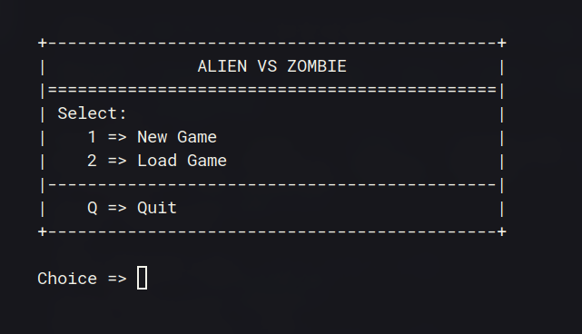

# Alien vs. Zombie

Simple cli game inspired by 'Alien Path'.

Game Settings

<p align="center">

</p>

<p align="center">

</p>

Game Dashboard

<p align="center">

</p>

## Compilation Instructions

How to run the code?

```
g++ pf/*.cpp main.cpp -o main.exe && ./main.exe
```

## User Manual

Game Instructions (On Arrow Key Input)

```
Instructions
1. arrow keys -> Move Alien
2. h -> Display Help Message
3. q -> Quit Game
4. s -> Save File
```

Game Instructions (On Type Commands Input)

```
Instructions  :
1. up/down/left/right -> Move Alien
2. help -> Display Help Message
3. quit -> Quit Game
4. save -> Save File
```

Run the code.

## Progress Log

- [Part 1](PART1.md)
- [Part 2](PART2.md)

## Contributors

- Lee Rong Yi
- Moali Douaa
- Abdulkafi Waleed Abdulkafi Al Malami
